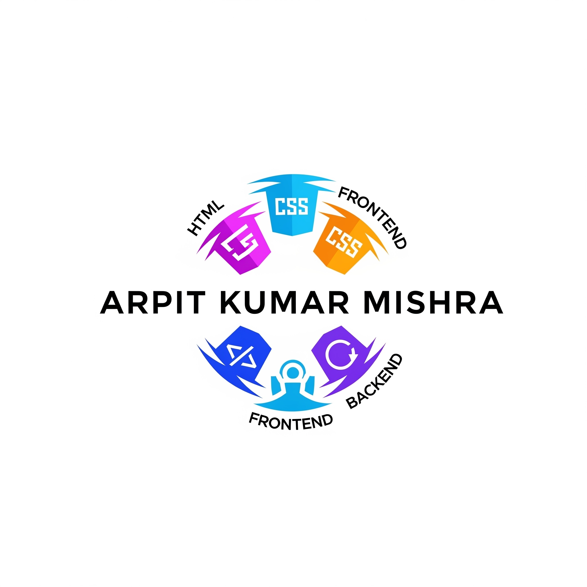
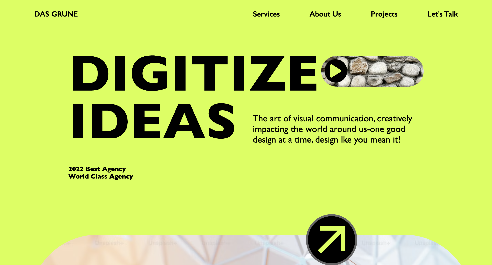

# Web Development Prep Project



This repository contains a comprehensive set of web development examples and projects, including a full-stack MERN application, React projects, and vanilla HTML/CSS/JS demos. It is organized for learning and experimenting with modern web technologies.

## Structure

- **Backend/**  
  Node.js Express backend with MongoDB integration. Features user registration, CRUD operations, EJS templating, and static asset serving.

- **HTML_CSS_JS/**  



  Learnt HTML, CSS and JavaScript basics and cloned the frontend of this website: https://dasgrune.webflow.io/

- **react/**  
  React project bootstrapped with Vite, demonstrating React fundamentals, hooks, and component-based UI.

- **react2/**  
  Advanced React project with routing, context API, Tailwind CSS integration, and API calls using Axios.

## Features

- **Backend**
  - Express server with RESTful routes
  - MongoDB user model and CRUD operations
  - EJS views for frontend rendering
  - Static file serving for CSS and JS

- **Frontend**
  - Multiple HTML/CSS/JS demos for DOM, events, and styling
  - React projects with component structure, hooks, and context
  - React Router DOM for navigation
  - Tailwind CSS for rapid UI development

## Getting Started

### Backend

1. Install dependencies:
   ```sh
   cd Backend
   npm install
   ```
2. Start the server:
   ```sh
   node app.js
   ```
   The server runs on port 3000.

### React Projects

1. Install dependencies:
   ```sh
   cd react2/react2
   npm install
   ```
2. Start the development server:
   ```sh
   npm run dev
   ```

## Learning Resources

- Examples of HTTP server and Express middleware
- CRUD operations with MongoDB and Mongoose
- React hooks, context API, and routing
- Tailwind CSS integration
- Vanilla JS DOM manipulation

## License

This project is for educational purposes.